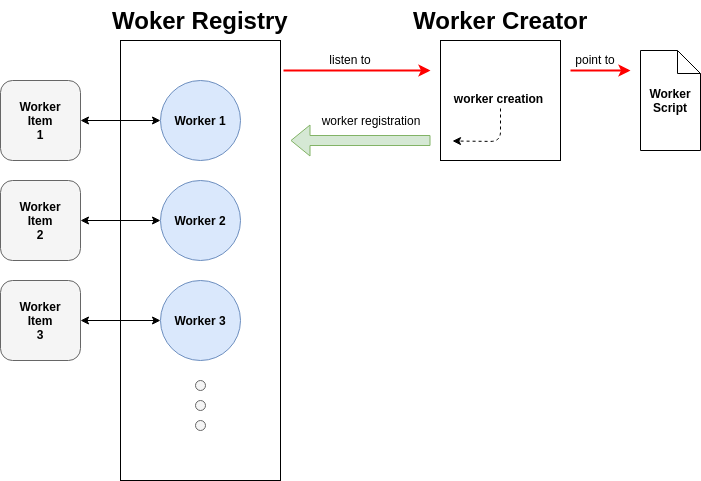

# Worker Control Elements

This repository contains a set of custom HTML elements that provide the ability
to manage [Web Workers](https://developer.mozilla.org/en-US/docs/Web/API/Web_Workers_API/Using_web_workers).

Here is the list of elements that are currently under development :
- [worker-creator](./elements/worker-creator.js)
- [worker-registry](./elements/worker-registry.js)
- [worker-item](./elements/worker-item.js)

The schema below give an overview on how the elements interact with each other.

## Contributing

These "worker controls" are published under the GPLv3 so feel free to use, copy,
redistribute and/or improve it as you like !

(see [LICENSE](./LICENSE) for more details).
